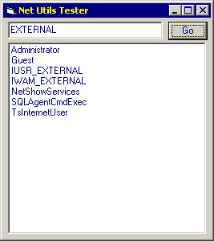



## Obtain Remote User List

### Description

Uses a few API calls to enumerate a list of users on a remote windows system.
 
### More Info
 

             |
---                |---
**Submitted On**   |2001-08-02 17:17:32
**By**             |[Not Applicable\_\_](https://github.com/Planet-Source-Code/PSCIndex/blob/master/ByAuthor/not-applicable.md)
**Level**          |Intermediate
**User Rating**    |4.7 (14 globes from 3 users)
**Compatibility**  |VB 5\.0, VB 6\.0
**Category**       |[Windows API Call/ Explanation](https://github.com/Planet-Source-Code/PSCIndex/blob/master/ByCategory/windows-api-call-explanation__1-39.md)
**World**          |[Visual Basic](https://github.com/Planet-Source-Code/PSCIndex/blob/master/ByWorld/visual-basic.md)
**Archive File**   |[Obtain Rem23975822001\.zip](https://github.com/Planet-Source-Code/not-applicable-obtain-remote-user-list__1-25790/archive/master.zip)

